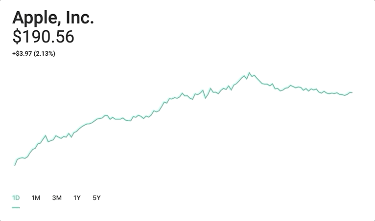

# README

[Greens](https://greensclone.herokuapp.com/), a clone of [Robinhood](https://robinhood.com/), is an app where users can view historic company stock prices in the form of charts. Users can also build up their own virtual portfolio.
---

## Technologies Used
Greens was built on the framework, Rails, to organize data related to users, companies and stock prices. Historical stock price data was provided for free by [IEX](https://iextrading.com/developer/). View [IEX's Terms of Use](https://iextrading.com/api-exhibit-a/). Company summery information was provided by [IEX](https://iextrading.com/developer/) and [Bloomberg](https://www.bloomberg.com/). Greens utilized the React/Redux and Recharts libraries to present information from the backend to the broswer.

## Features
- create and retrieve account
- search existing companies in the database
- view historic company stock price on charts at different timeframes
- hover over chart to view specific historic price 
- view specific company information and recent news
- buy virtual shares of company stocks
- keep portfolio of virtual active positions

## Future Features
- account holds a watchlist
  - be able to add and remove items on watchlist
- create historic data for user portfolio 
  - display user portfolio on dashboard chart